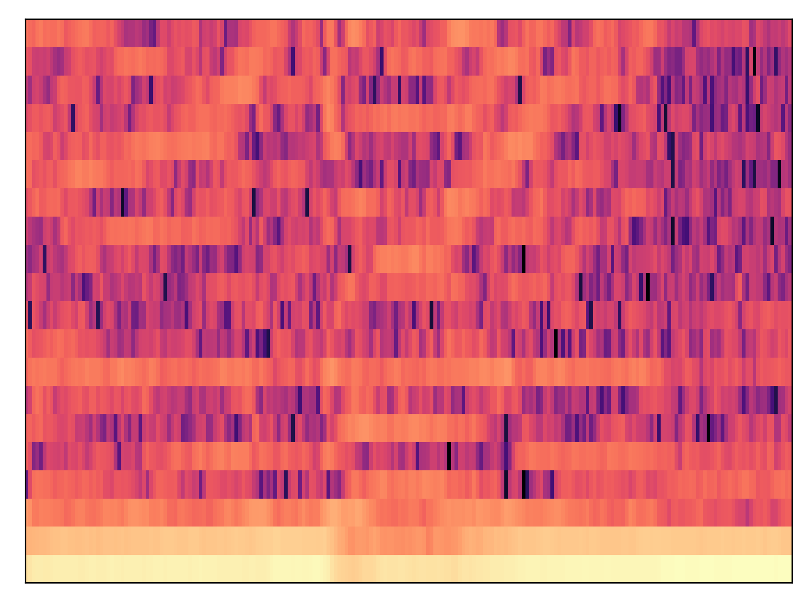
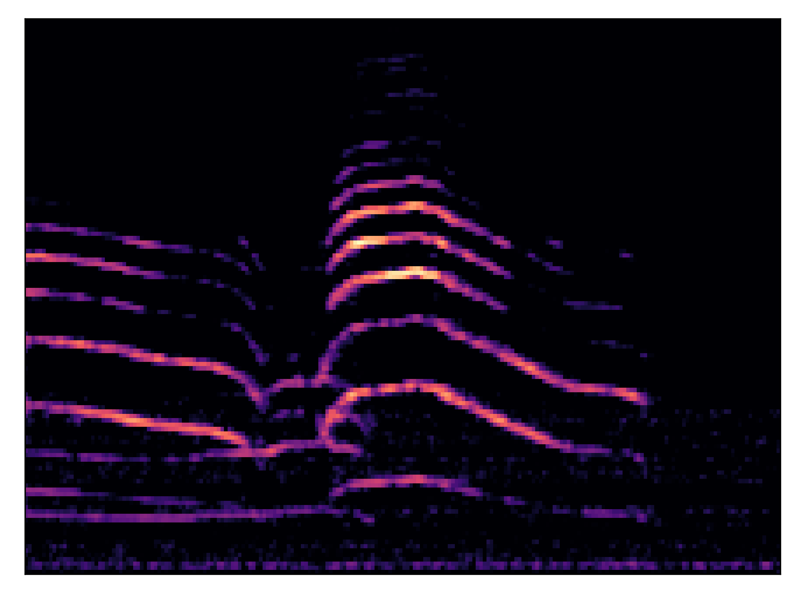
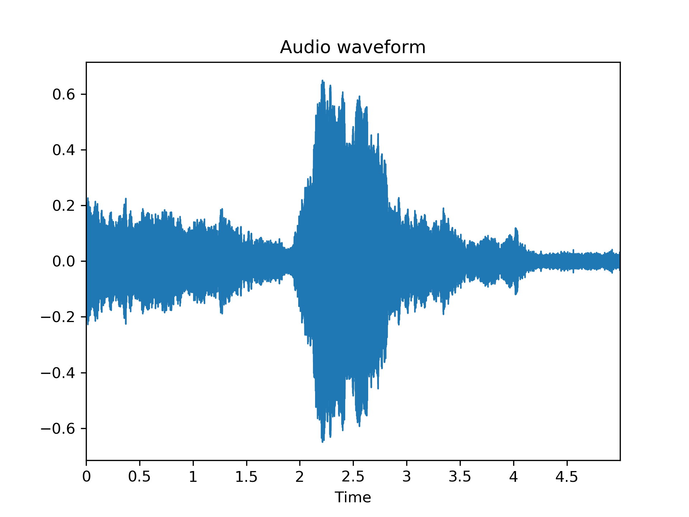
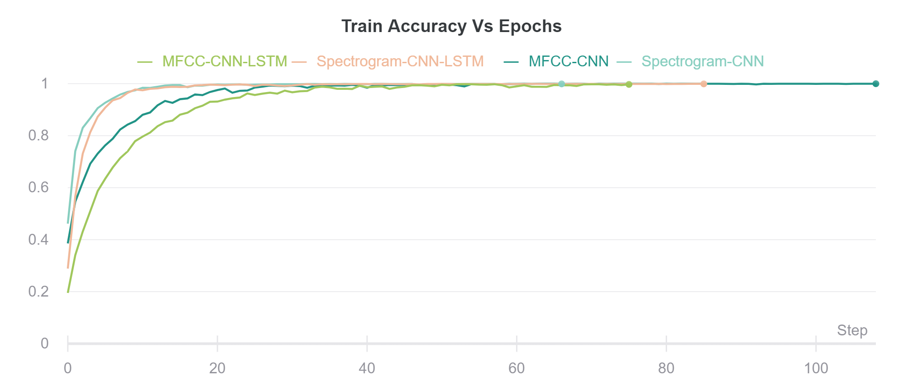
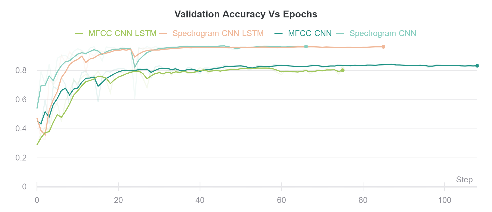
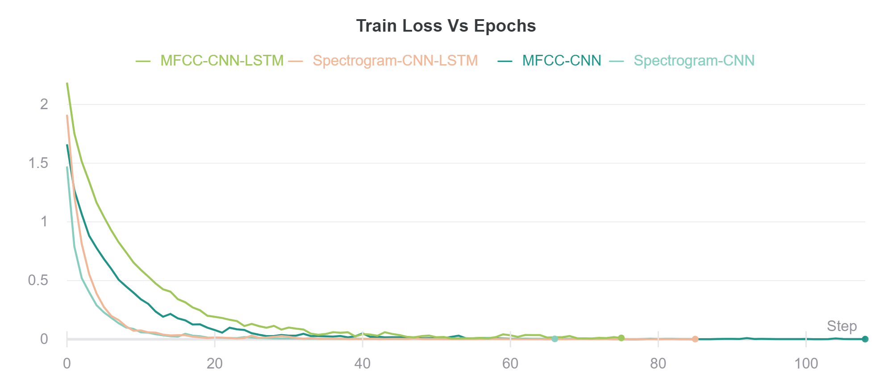

# Audio classification using CNN and LSTM

<!-- Foobar is a Python library for dealing with word pluralization. -->

## Data Visualization

### MFCC Features


### Spectrogram



### Raw Audio



## Results


<!-- 
|   |Training   |Validation  |testing   |
|---|-----------|--------|--------------|
|Dice Loss      |0.084   |0.098   |0.098|
|Mean IOU       |0.776   |0.763   |0.762|

### CNN

|:------------:|:-----------:|:----------:|:-----:|:----------:|
|    Dataset   | Spectrogram |            |  MFCC |            |
|              |    Train    | Validation | Train | Validation |
| urbansound8k |             |            |       |            |
 -->


<style type="text/css">
.tg  {border-collapse:collapse;border-spacing:0;}
.tg td{font-family:Arial, sans-serif;font-size:14px;padding:10px 5px;border-style:solid;border-width:1px;overflow:hidden;word-break:normal;border-color:black;}
.tg th{font-family:Arial, sans-serif;font-size:14px;font-weight:normal;padding:10px 5px;border-style:solid;border-width:1px;overflow:hidden;word-break:normal;border-color:black;}
.tg .tg-c3ow{border-color:inherit;text-align:center;vertical-align:top}
</style>
<table class="tg">
  <tr>
    <th class="tg-c3ow" colspan="5">CNN</th>
  </tr>
  <tr>
    <td class="tg-c3ow"></td>
    <td class="tg-c3ow" colspan="2">Spectrogram</td>
    <td class="tg-c3ow" colspan="2">MFCC</td>
  </tr>
  <tr>
    <td class="tg-c3ow">Dataset</td>
    <td class="tg-c3ow">Train</td>
    <td class="tg-c3ow">Validation</td>
    <td class="tg-c3ow">Train</td>
    <td class="tg-c3ow">Validation</td>
  </tr>
  <tr>
    <td class="tg-c3ow">urbansound8k</td>
    <td class="tg-c3ow">99.914</td>
    <td class="tg-c3ow">97.252</td>
    <td class="tg-c3ow">100</td>
    <td class="tg-c3ow">84.544</td>
  </tr>
</table>


#
<style type="text/css">
.tg  {border-collapse:collapse;border-spacing:0;}
.tg td{font-family:Arial, sans-serif;font-size:14px;padding:10px 5px;border-style:solid;border-width:1px;overflow:hidden;word-break:normal;border-color:black;}
.tg th{font-family:Arial, sans-serif;font-size:14px;font-weight:normal;padding:10px 5px;border-style:solid;border-width:1px;overflow:hidden;word-break:normal;border-color:black;}
.tg .tg-c3ow{border-color:inherit;text-align:center;vertical-align:top}
</style>
<table class="tg">
  <tr>
    <th class="tg-c3ow" colspan="5">CNN-LSTM</th>
  </tr>
  <tr>
    <td class="tg-c3ow"></td>
    <td class="tg-c3ow" colspan="2">Spectrogram</td>
    <td class="tg-c3ow" colspan="2">MFCC</td>
  </tr>
  <tr>
    <td class="tg-c3ow">Dataset</td>
    <td class="tg-c3ow">Train</td>
    <td class="tg-c3ow">Validation</td>
    <td class="tg-c3ow">Train</td>
    <td class="tg-c3ow">Validation</td>
  </tr>
  <tr>
    <td class="tg-c3ow">urbansound8k</td>
    <td class="tg-c3ow">99.928</td>
    <td class="tg-c3ow">96.451</td>
    <td class="tg-c3ow">99.985</td>
    <td class="tg-c3ow">82.369</td>
  </tr>
</table>


### Training Accuracy Plot




### Validation Accuracy Plot



### Training Error Plot



### Validation Error Plot


## Installation

Use the package manager [pip](https://pip.pypa.io/en/stable/) to install foobar.

```bash
pip install requirements.txt 
```

or

```bash
conda create --name <env> --file requirements.txt 
```

## Usage
### Dataset 
[urbansound8k]

### Pre-process Data

```bash
python codes/pre_processing/pre_processing_urbansound.py
```
### Train and Test
```bash
python codes/baseline/main.py
```


[urbansound8k]: [https://urbansounddataset.weebly.com/urbansound8k.html]

## Contributing
Pull requests are welcome. For major changes, please open an issue first to discuss what you would like to change.

Please make sure to update tests as appropriate.


## License
[MIT](https://choosealicense.com/licenses/mit/)